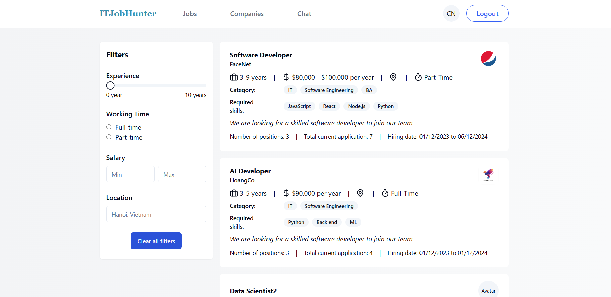
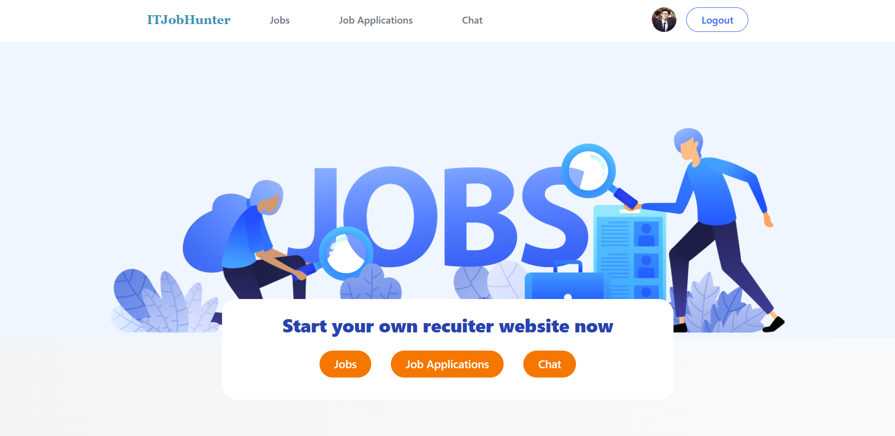
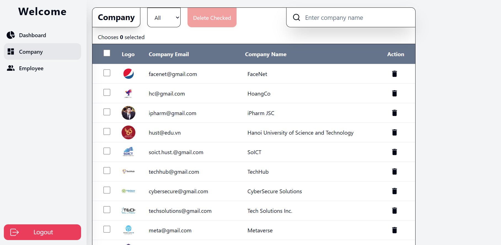

<!-- PROJECT LOGO -->
<br />
<div align="center">
    


  <h1 className='text-xl text-cyan-600 font-bold font-serif'>ITJobHunter</h1>

  <p align="center">
    Find your dream IT job now
    <br />
    <a href="https://github.com/PhiVietHoang/ITJobHunter"><strong>Explore the docs »</strong></a>
    <br />
    <br />
    <a href="https://itjobhunter.netlify.app/">View Demo</a>
    ·
    <a href="https://github.com/PhiVietHoang/ITJobHunter/issues">Report Bug</a>
  </p>
</div>


<!-- TABLE OF CONTENTS -->
<details>
  <summary>Table of Contents</summary>
  <ol>
    <li>
      <a href="#about-the-project">About The Project</a>
      <ul>
        <li><a href="#built-with">Built With</a></li>
      </ul>
    </li>
    <li>
      <a href="#getting-started">Getting Started</a>
      <ul>
        <li><a href="#prerequisites">Prerequisites</a></li>
        <li><a href="#installation">Installation</a></li>
      </ul>
    </li>
    <li><a href="#usage">Usage</a></li>
  </ol>
</details>


<!-- ABOUT THE PROJECT -->
## About The Project

Nowadays, the demand for skilled IT professionals is constantly on the rise. To bridge the gap between job seekers and employers, we propose an IT job portal website - itJobHunter.
<br>
Our website will offer a user-friendly and feature-rich interface that ensures a good experience for all users. 

<p align="right">(<a href="#readme-top">back to top</a>)</p>


### Built With

* MERN Stack.
* Github/Git: Version Control
* Others: Postman, MongoDb Atlas...
* Google Sheet, Drive and Astah for document management
* Deploy: CI/CD (CircleCI)


<p align="right">(<a href="#readme-top">back to top</a>)</p>


<!-- GETTING STARTED -->
## Getting Started

This is an example of how you may give instructions on setting up your project locally.
To get a local copy up and running follow these simple example steps.

### Prerequisites

This is an example of how to list things you need to use the software and how to install them.
* npm
  ```sh
  npm install npm@latest -g
  ```

### Installation

1. Clone the repo
   ```sh
   git clone https://github.com/PhiVietHoang/ITJobHunter.git
   ```
2. Move to server and client folder
   ```sh
   cd server
   ```
   ```sh
   cd client
   ```
3. Install packages
   ```js
   npm i
   ```
4. Set up the environment
5. Run the project
   ```js
   npm run dev
   ```
<p align="right">(<a href="#readme-top">back to top</a>)</p>


<!-- USAGE EXAMPLES -->
## Usage
<div>
  
  
  
</div>

<p align="right">(<a href="#readme-top">back to top</a>)</p>
